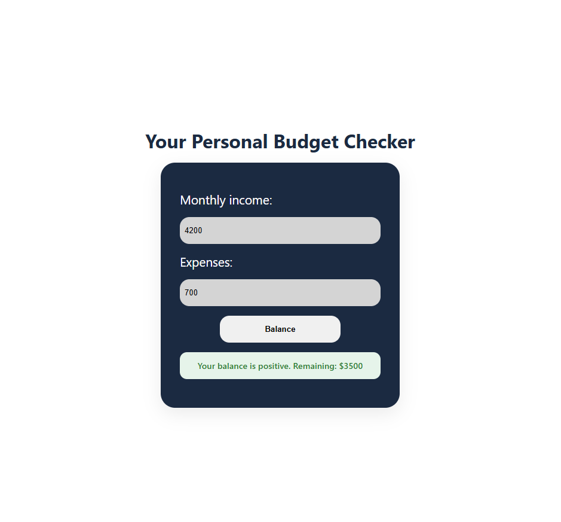

# 💰 Personal Budget Checker

A simple web application to calculate monthly balance, built with vanilla JavaScript for learning and practicing front-end fundamentals.

The user inputs their monthly income and expenses, and the application returns a clear visual status of the balance.

---

## ✨ Features

- Monthly income input
- Expenses input
- Automatic balance calculation
- Visual feedback for balance status (positive, zero, or negative)
- Centered and responsive UI

---

## 🛠️ Tech Stack

- HTML5
- CSS3 (Flexbox)
- JavaScript (DOM manipulation, functions, conditionals)

---

## 📸 Preview

